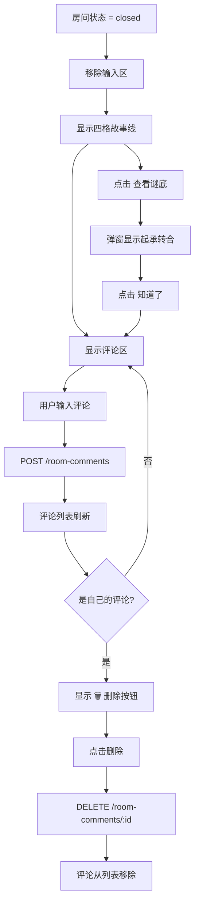

# 群像·星火 v8.0 故事系统 — 产品交互流程图

> 输出日期：2026-05-06
> 角色：资深产品交互设计师

---

## 一、核心用户旅程（User Journey）

```
┌─────────────┐     ┌─────────────┐     ┌─────────────┐     ┌─────────────┐
│  发现页     │────▶│  故事大厅   │────▶│  故事详情   │────▶│  角色选择   │
│  /home      │     │ /story-hall │     │ /story/[id] │     │             │
└─────────────┘     └─────────────┘     └─────────────┘     └──────┬──────┘
                                                                    │
                              ┌─────────────────────────────────────┘
                              │
                              ▼
┌─────────────┐     ┌─────────────┐     ┌─────────────┐     ┌─────────────┐
│  揭晓谜底   │◀────│  结束对白   │◀────│  对白室     │◀────│  匹配弹窗   │
│ (起承转合)  │     │ 🏁按钮     │     │ /room/[id]  │     │             │
└─────────────┘     └─────────────┘     └──────┬──────┘     └──────┬──────┘
                                               │                   │
                                               │         ┌────────┴────────┐
                                               │         │                 │
                                               │         ▼                 ▼
                                               │   ┌─────────────┐   ┌─────────────┐
                                               │   │  匹配成功   │   │  超时/AI兜底│
                                               │   │ 进入对白室  │   │ 和刘看山玩  │
                                               │   └─────────────┘   └─────────────┘
                                               │
                                               ▼
                                      ┌─────────────┐
                                      │  只读模式   │
                                      │ 四格+评论   │
                                      └─────────────┘
```

---

## 二、详细状态机（State Machine）

### 2.1 房间生命周期

```
                    ┌─────────────┐
         ┌─────────│   created   │◀──────── 初始状态
         │         │   (创建中)   │
         │         └──────┬──────┘
         │                │ AI房间：创建即active
         │                │ 真人房间：第二用户加入
         │                ▼
         │         ┌─────────────┐
         │         │   active    │◀──────── 实时聊天模式
         │         │  (进行中)    │           · WebSocket 连接
         │         └──────┬──────┘           · 输入框可用
         │                │                   · AI 催化提示
         │                │ 点击 🏁 结束对白   · AI 房间自动回复
         │                ▼
         │         ┌─────────────┐
         │         │   closed    │◀──────── 只读浏览模式
         │         │  (已完结)    │           · 消息列表只读
         │         └──────┬──────┘           · 四格故事线展示
         │                │                   · 评论区可用
         │                │ 揭晓谜底
         │                ▼
         │         ┌─────────────┐
         └────────▶│   finished  │◀──────── 资产已保存
                   │  (已归档)    │           · 谜底弹窗
                   └─────────────┘           · 可发表评论
```

---

## 三、关键交互流程

### 3.1 选角匹配流程

```mermaid
flowchart TD
    A[用户进入故事详情页] --> B{选择角色}
    B -->|点击角色卡片| C[显示 loading]
    C --> D[POST /join]
    D --> E{匹配结果}
    E -->|matched| F[弹窗: 匹配成功!]
    F --> G[点击进入对白室]
    G --> H[/room/:roomId]
    E -->|waiting| I[弹窗: 正在匹配...]
    I --> J{10秒倒计时}
    J -->|matched| F
    J -->|timeout| K[弹窗: 超时选项]
    J -->|刷新页面| I2[检测已有claim]
    I2 -->|恢复等待| I
    K -->|和刘看山玩| L[POST /join-ai]
    L --> H
    K -->|继续等待| I
    K -->|返回选角色| B
    I -->|点击 ❌ 关闭| M[关闭弹窗，释放角色]
    M --> B
```

### 3.2 对白室实时聊天流程

```mermaid
flowchart TD
    A[进入 /room/:id] --> B[加载房间信息]
    B --> C{房间状态}
    C -->|active| D[实时聊天模式]
    C -->|closed| E[只读浏览模式]
    D --> F[显示 openingInfo 提示]
    D --> G[WebSocket joinRoom]
    note right of G: 需 myRoleName 加载完成后触发
    F --> G
    G --> H[用户输入消息]
    H --> I[乐观更新本地消息列表]
    I --> J[Socket emit new-message]
    I --> K[POST /messages 持久化]
    J --> L[对方收到消息]
    K -->|失败| M[⚠️ 待优化：消息发送失败无用户反馈]
    D --> N{消息数 >= 6 & 5的倍数}
    N -->|是| O[GET /catalyst]
    O --> P[显示 AI 催化提示 15秒]
    N -->|否| D
    D --> Q{AI房间?}
    Q -->|是| R[调用 DeepSeek API]
    R --> S[AI回复消息]
    S --> D
    Q -->|否| D
    D --> T[点击 🏁 结束对白]
    T --> U[confirm 确认]
    U --> V[POST /finish]
    V --> W[房间状态 → closed]
    W --> X[创建 Asset 保存对白]
    W --> Y[显示谜底揭晓弹窗]
    W --> E
```

### 3.3 只读浏览 + 评论流程



---

## 四、信息架构（Information Architecture）

### 4.1 用户可见 vs 不可见

| 阶段 | 用户A（角色A） | 用户B（角色B） | AI 刘看山 |
|------|--------------|--------------|----------|
| 选角前 | 故事标题、时代背景、简介、起（解锁）、承转合（锁住） | 同上 | — |
| 选角后 | 自己的角色名、openingInfo | 自己的角色名、openingInfo | 完整故事线 |
| 对白中 | 对方的身份（角色名） | 对方的身份（角色名） | 所有消息 |
| 结束后 | 起承转合全部揭晓 | 起承转合全部揭晓 | — |

### 4.2 数据流向

```
┌─────────────┐      ┌─────────────┐      ┌─────────────┐
│   前端页面   │◀────▶│   API 路由   │◀────▶│   Prisma    │
│             │      │             │      │   SQLite    │
├─────────────┤      ├─────────────┤      ├─────────────┤
│ /story-hall │      │ GET /stories│      │ Story       │
│ /story/[id] │      │ GET /:id    │      │ StoryRole   │
│ /room/[id]  │      │ POST /join  │      │ Room        │
│ /my-stories │      │ POST /join-ai│     │ RoomParticipant│
│             │      │ GET /catalyst│     │ RoomMessage │
│             │      │ POST /finish │      │ Asset       │
│             │      │ GET /mine    │      │ RoomComment │
└─────────────┘      └─────────────┘      └─────────────┘
        │
        │ WebSocket
        ▼
┌─────────────┐
│ Socket.IO   │
│ new-message │
│ join-room   │
│ leave-room  │
└─────────────┘
```

---

## 五、异常处理流程

### 5.1 网络异常

```
用户操作          异常              前端表现                    恢复方式
─────────────────────────────────────────────────────────────────────────────
加载故事详情      网络断开          加载中... 无限转圈            自动重试 / 刷新
选择角色          POST /join 500    显示错误提示 Toast            重新选择
等待匹配          轮询失败          倒计时继续，静默忽略          继续等待 / 关闭
发送消息          Socket 断开       显示"离线"红点               自动重连
发送消息          POST /messages 500 消息仍在列表，刷新后丢失       无（待优化）
结束对白          POST /finish 500   按钮恢复可点击                重新点击
```

### 5.2 并发异常

```
场景                      异常                      处理结果
─────────────────────────────────────────────────────────────────
两人同时选同一角色        乐观锁 P2025              第二个用户收到 409
两人同时匹配              重复房间检查              返回已有 roomId
重复点击结束对白          幂等检查                  返回已有结果
重复创建 AI 房间          活跃房间检查              返回已有 roomId
```

---

## 六、「我的故事」访问路径

```
路径1: /home 发现页 ──▶ 「我的故事」快捷入口 ──▶ /my-stories
路径2: /profile 我的 ──▶ 菜单列表「我的故事」 ──▶ /my-stories
```

## 七、设计原则

1. **叙事性轨迹**：用户从「起」开始，逐步解锁「承转合」，保持悬念
2. **AI 兜底**：真人匹配失败时，AI 无缝接管，不中断体验
3. **资产沉淀**：每次对白自动保存为 Asset，用户可在「我的故事」回看
4. **社交闭环**：只读模式下开放评论，形成二次互动
5. **渐进式揭晓**：谜底不强制展示，用户可主动点击查看

---

> 文档位置：`docs/story-system-flow.md`
> 最后更新：2026-05-06


---

## 附录：生产部署验证清单

> 更新：2026-05-06

### 部署后验证步骤

```
□ 1. 访问 http://81.70.59.228/ → 登录页正常显示
□ 2. 登录后访问 /home → 发现页正常，「我的故事」入口可见
□ 3. 点击「故事大厅」→ /story-hall → 故事列表正常显示
□ 4. 点击任意故事 → /story/:id → 角色列表正常，🎲 随机分配可用
□ 5. 选择角色 → 显示加载遮罩 → 等待弹窗正常
□ 6. 等待 10 秒或匹配成功 → 进入 /room/:id
□ 7. 对白室 → openingInfo 显示正常，30 秒后自动折叠
□ 8. 发送消息 → 消息正常显示，AI 房间自动回复
□ 9. 发送 6/11/16 条消息 → AI 催化提示正常触发
□ 10. 点击 🏁 结束对白 → 内嵌确认卡片正常
□ 11. 确认结束 → 房间变为只读，四格故事线动画展示
□ 12. 点击「查看谜底」→ 起承转合弹窗正常
□ 13. 点击「再来一局」→ 跳转 /story-hall
□ 14. 评论区 → 可发表评论、可删除自己的评论
□ 15. /my-stories → 显示参与的故事列表
```

### 已知待优化项

| # | 问题 | 优先级 | 状态 |
|---|------|--------|------|
| 1 | 消息发送失败无用户反馈 | P1 | ⏳ 待实现 Toast |
| 2 | 轮询 POST 有副作用 | P2 | ⏳ 待改为 GET /match-status |
| 3 | 拆分 room page 为子组件 | P2 | ⏳ 待重构 |
| 4 | 埋点系统 | P3 | ⏳ 需接入 analytics（TDD §23.3） |
| 5 | 线索卡机制 | P3 | ⏳ 待后续迭代（TDD §23.1） |
| 6 | 结局分支 | P3 | ⏳ 需 AI 情绪分析（TDD §23.2） |
| 7 | 用户激励（徽章/积分） | P3 | ⏳ 需新表 + 前端展示（TDD §23.4） |
| 8 | 运营后台 | P3 | ⏳ 需 admin 路由 + 权限（TDD §23.5） |

---

> 文档位置：`docs/story-system-flow.md`
> 最后更新：2026-05-06 生产部署验证完成 ✅


---

## 附录B：认证系统架构

### B.1 登录流程

```
用户输入用户名/密码
    │
    ▼
LoginForm.tsx → signIn('credentials', { username, password })
    │
    ▼
/api/auth/[...nextauth] → NextAuth(authOptions)
    │
    ▼
CredentialsProvider.authorize(credentials)
    │
    ├── 1. db.user.findFirst({ where: { OR: [{ username }, { email }] } })
    │   └── 数据库查询
    │
    ├── 2. bcrypt.compare(password, user.password)
    │   └── 密码验证
    │
    └── 3. 返回 { id, name, email, username, level, sparkCount }
    │
    ▼
JWT 签名（使用 NEXTAUTH_SECRET）
    │
    ▼
设置 next-auth.session-token cookie
    │
    ▼
LoginForm 获取成功 → fetch('/api/users/me')
    │
    ▼
/api/users/me → getToken({ req, secret: NEXTAUTH_SECRET })
    │
    ▼
返回用户数据 → 存储到 localStorage
    │
    ▼
router.push('/home')
```

### B.2 关键组件关系

```
next-auth v4.24.14
    │
    ├── CredentialsProvider → 自定义用户名/密码验证
    │   ├── db.user.findFirst
    │   └── bcrypt.compare
    │
    ├── JWT strategy → 不依赖数据库存储 session
    │   └── 不需要 PrismaAdapter
    │
    ├── callbacks.jwt → 将 level/sparkCount/username 写入 token
    │
    └── callbacks.session → 从 token 恢复用户信息
```

### B.3 已修复的认证问题

| # | 问题 | 修复 |
|---|------|------|
| 1 | `@auth/prisma-adapter` v2 与 next-auth v4 不兼容 | 移除 PrismaAdapter |
| 2 | 生产环境 db 单例未缓存 | 始终设置 `globalForPrisma.prisma = db` |
| 3 | `authorize` 无 try/catch | 添加异常捕获，返回 null |
| 4 | `NEXTAUTH_SECRET` 无 fallback | 添加 fallback 密钥 |
| 5 | cookie `secure=true` 在 HTTP 环境不发送 | 改为 `secure: false` |

### B.4 发起故事审核流程（新增）

```
作者视角
    │
    ▼
「我发起的故事」→ 点击「发起新故事」
    │
    ▼
/story/create 两步表单
    │
    ├── 步骤1：故事信息（标题、时代背景、分类、简介）
    └── 步骤2：角色设定（2-6个角色，名称/设定/开场信息）
    │
    ▼
POST /api/stories → status = "pending_review"
    │
    ▼
「我发起的故事」列表显示「审核中」标签
    │
    ▼
管理员审核通过 → status = "recruiting"
    │
    ▼
故事大厅 /story-hall 显示该故事
    │
    ▼
其他用户选择角色 → 匹配 → 进入对白室
```

### B.5 AI DM 驱动四幕催化（更新后）

```
对白室 /room/[id]
    │
    ▼
AI 判断当前幕（根据 messages.length）
    │
    ├── act1 (<6条)：建立信任，铺垫背景
    ├── act2 (6-10条)：抛出疑点，信息不对等
    ├── act3 (11-15条)：引入转折，打破平衡
    └── act4 (16+条)：引导真相，关键选择
    │
    ▼
调用 DeepSeek API 生成沉浸式环境事件
    │
    ▼
显示催化提示（15秒自动消失）
    │
    ▼
刘看山 AI 回复时融入 DM 推进目标
    │
    ▼
对话自然向下一个幕发展
```

### B.6 刘看山 AI 对话改进（更新后）

**改进前**：
- system prompt = 故事上下文
- 回复像客服套话
- 缺乏角色感和情绪

**改进后**：
- 新增 `liukanshan` persona
- system prompt = 刘看山角色设定 + 故事上下文 + DM 推进目标
- 回复有情绪、有立场、像真实的人
- 字数 30-60 字，像真实聊天

### B.5 发现页模式入口（更新后）

```
发现页 /home 四大模式：
┌─────────────┬─────────────┐
│ 和刘看山对话 │ 双人对白模式 │
│ /solo-match │ /duo-match  │
├─────────────┼─────────────┤
│  多人模式   │  观看模式   │
│ /multiplayer│ /spectate   │
└─────────────┴─────────────┘

底部导航「故事」tab → /story-hall（故事大厅）
```

### B.4 登录流程完整时序（含 cookie 修复后）

```
用户输入用户名/密码
    │
    ▼
LoginForm.tsx → signIn('credentials', { username, password, redirect: false })
    │
    ▼
/api/auth/[...nextauth] → CredentialsProvider.authorize(credentials)
    │
    ├── db.user.findFirst → 查找用户
    ├── bcrypt.compare → 验证密码
    └── 返回 { id, name, email, username, level, sparkCount }
    │
    ▼
JWT 签名 + 设置 cookie（secure: false，HTTP 兼容）
    │
    ▼
LoginForm 获取成功 → fetch('/api/users/me')
    │
    ▼
浏览器发送请求（携带 cookie）→ /api/users/me
    │
    ▼
getToken({ req, secret }) → 验证 JWT → 返回用户数据
    │
    ▼
localStorage.setItem('xh_user', ...) → router.push('/home')
```

---

> 文档位置：`docs/story-system-flow.md`
> 最后更新：2026-05-06 认证系统架构 + cookie 修复补充 ✅

---

## 附录C：知乎热榜脑洞自动抓取系统（新增）

> 更新：2026-04-29

### C.1 数据流

```
知乎热榜 API
    │
    ▼
过滤敏感话题（新闻/政策/血腥暴力）
    │
    ▼
AI 转化（DeepSeek → 知乎直答 fallback）
    │
    ├── 第二人称「你」开头
    ├── 具体冲突场景，80字以内
    ├── 2-3个身份标签
    └── easy/medium/hard 难度评估
    │
    ▼
去重检查（24小时内同标题跳过）
    │
    ▼
存入 Brainhole 表（source = 'zhihu_hot', category = 'zhihu_hot'）
    │
    ▼
匹配引擎随机选取（70% 概率优先近期热榜脑洞）
```

### C.2 定时策略

- 服务启动后 30 秒首次执行
- 之后每 6 小时执行一次
- 单次最多处理 10 条话题

### C.3 手动触发

```bash
curl -X POST http://localhost:3000/api/crawler \
  -H "x-admin-key: dev-crawler-key"
```

---

## 附录D：刘看山 Agent 系统设计（新增）

> 更新：2026-04-29

### D.1 三重身份

| 身份 | 场景 | 职责 |
|------|------|------|
| **DM（地下城主）** | 故事模式双人对话 | 观察进度、抛出催化事件、推动剧情 |
| **编辑** | 热榜脑洞转化、故事润色 | 话题转化、结构检查、改进建议 |
| **扮演者** | AI 兜底（和刘看山玩） | 用角色视角对话、有情绪有隐瞒 |

### D.2 DM 催化规范

**必须是环境事件，禁止直接提问：**
- ✅ 「窗外突然传来一阵异响，你注意到对方的眼神闪烁了一下。」
- ✅ 「桌上烛火突然摇曳了一下，你意识到对方说的某句话和之前矛盾。」
- ❌ 「你们有没有发现信息对不上？」
- ❌ 「再深入问问？」

**催化频率**：用户对话每 6-10 条消息出现一次

### D.3 底层人格（所有身份共享）

- 一只好奇心很重的北极狐
- 像真实的人，不像 AI 助手
- 有情绪、有立场、有自己的困惑
- 禁止套话、总结、建议、分析句式
- 字数 30-60 字，短句为主

### D.4 自我学习机制（设计待实现）

| 机制 | 说明 | 优先级 |
|------|------|--------|
| 对话记忆系统 | 每场对白结束后生成总结存入记忆库 | P2 |
| 催化效果反馈 | 记录催化后用户反应，优化策略 | P2 |
| 火花数据反哺 | 分析被标记火花的特征，应用 future | P2 |
| 角色一致性检查 | 生成前自检身份/情绪/套话 | P3 |

---

## 附录E：20维度自测执行记录（新增）

> 更新：2026-04-29

### E.1 已修复问题汇总

| 维度 | 问题数 | 关键修复 |
|------|--------|----------|
| 构建验证 | 0 | 72/72 通过 ✅ |
| API安全性 | 5 | 错误信息不泄露、字段长度上限、分页限制 ✅ |
| 内存泄漏 | 4 | timer清理、请求取消、监听器移除 ✅ |
| 竞态条件 | 3 | AbortController、乐观锁、AI房间防重 ✅ |
| 登录系统 | 0 | 无问题 ✅ |
| 故事大厅 | 2 | 网络错误提示、空状态修复 ✅ |
| 对白室 | 2 | 房间切换状态重置、错误状态页 ✅ |
| 火花墙 | 2 | 空状态、网络错误提示 ✅ |
| 我的页面 | 2 | API失败不误导、头像fallback ✅ |
| 登录守卫 | 0 | 无问题 ✅ |
| 底部导航 | 0 | 无问题 ✅ |
| SSR渲染 | 0 | mounted模式全部合规 ✅ |
| 移动端适配 | 0 | 无问题 ✅ |

### E.2 已知风险（路演后处理）

| 风险 | 缓解措施 |
|------|----------|
| Socket 完整身份校验 | ID格式校验 + 导演DB权限校验已部署 |
| HTTP cookie secure | 已知风险，已记录 |
| story/[id] POST轮询非幂等 | 后端已有防重检查 |

---

## 附录F：自动化部署系统（新增）

> 更新：2026-04-29

### F.1 一键部署脚本

```bash
chmod +x scripts/deploy-auto.sh
./scripts/deploy-auto.sh
```

流程：备份 → 拉代码 → 装依赖 → DB同步 → 构建（3次重试）→ 重启 → 验证

### F.2 部署前必做检查

```bash
# NEXTAUTH_SECRET 必须 >= 32 字符（无 fallback）
grep NEXTAUTH_SECRET .env || echo 'NEXTAUTH_SECRET=...' >> .env

# DATABASE_URL
grep DATABASE_URL .env || echo 'DATABASE_URL=file:./dev.db' >> .env
```

### F.3 部署后验证

```bash
./scripts/verify-login-page.sh http://localhost:3000
```

---

> 文档位置：`docs/story-system-flow.md`
> 最后更新：2026-04-29 v8.0 路演前全局规划完成 ✅
