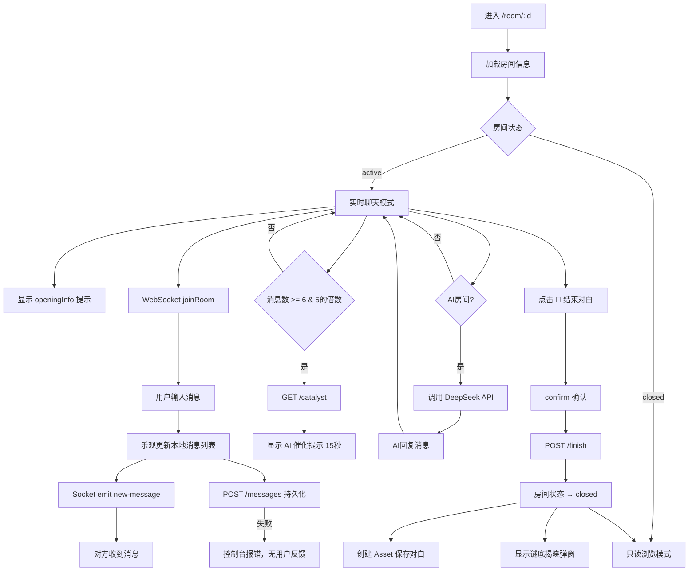
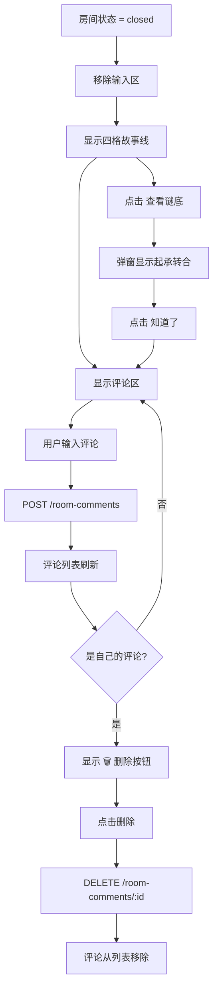

# 群像·星火 v8.0 故事系统 — 产品交互流程图

> 输出日期：2026-05-06
> 角色：资深产品交互设计师

---

## 一、核心用户旅程（User Journey）

```
┌─────────────┐     ┌─────────────┐     ┌─────────────┐     ┌─────────────┐
│  发现页     │────▶│  故事大厅   │────▶│  故事详情   │────▶│  角色选择   │
│  /home      │     │ /story-hall │     │ /story/[id] │     │             │
└─────────────┘     └─────────────┘     └─────────────┘     └──────┬──────┘
                                                                    │
                              ┌─────────────────────────────────────┘
                              │
                              ▼
┌─────────────┐     ┌─────────────┐     ┌─────────────┐     ┌─────────────┐
│  揭晓谜底   │◀────│  结束对白   │◀────│  对白室     │◀────│  匹配弹窗   │
│ (起承转合)  │     │ 🏁按钮     │     │ /room/[id]  │     │             │
└─────────────┘     └─────────────┘     └──────┬──────┘     └──────┬──────┘
                                               │                   │
                                               │         ┌────────┴────────┐
                                               │         │                 │
                                               │         ▼                 ▼
                                               │   ┌─────────────┐   ┌─────────────┐
                                               │   │  匹配成功   │   │  超时/AI兜底│
                                               │   │ 进入对白室  │   │ 和刘看山玩  │
                                               │   └─────────────┘   └─────────────┘
                                               │
                                               ▼
                                      ┌─────────────┐
                                      │  只读模式   │
                                      │ 四格+评论   │
                                      └─────────────┘
```

---

## 二、详细状态机（State Machine）

### 2.1 房间生命周期

```
                    ┌─────────────┐
         ┌─────────│   created   │◀──────── 初始状态
         │         │   (创建中)   │
         │         └──────┬──────┘
         │                │ 用户加入完成
         │                ▼
         │         ┌─────────────┐
         │         │   active    │◀──────── 实时聊天模式
         │         │  (进行中)    │           · WebSocket 连接
         │         └──────┬──────┘           · 输入框可用
         │                │                   · AI 催化提示
         │                │ 点击 🏁 结束对白   · AI 房间自动回复
         │                ▼
         │         ┌─────────────┐
         │         │   closed    │◀──────── 只读浏览模式
         │         │  (已完结)    │           · 消息列表只读
         │         └──────┬──────┘           · 四格故事线展示
         │                │                   · 评论区可用
         │                │ 揭晓谜底
         │                ▼
         │         ┌─────────────┐
         └────────▶│   finished  │◀──────── 资产已保存
                   │  (已归档)    │           · 谜底弹窗
                   └─────────────┘           · 可发表评论
```

---

## 三、关键交互流程

### 3.1 选角匹配流程

```mermaid
flowchart TD
    A[用户进入故事详情页] --> B{选择角色}
    B -->|点击角色卡片| C[显示 loading]
    C --> D[POST /join]
    D --> E{匹配结果}
    E -->|matched| F[弹窗: 匹配成功!]
    F --> G[点击进入对白室]
    G --> H[/room/:roomId]
    E -->|waiting| I[弹窗: 正在匹配...]
    I --> J{15秒倒计时}
    J -->|matched| F
    J -->|timeout| K[弹窗: 超时选项]
    K -->|和刘看山玩| L[POST /join-ai]
    L --> H
    K -->|继续等待| I
    K -->|返回选角色| B
    I -->|点击 ❌ 关闭| M[关闭弹窗，释放角色]
    M --> B
```

### 3.2 对白室实时聊天流程



### 3.3 只读浏览 + 评论流程



---

## 四、信息架构（Information Architecture）

### 4.1 用户可见 vs 不可见

| 阶段 | 用户A（角色A） | 用户B（角色B） | AI 刘看山 |
|------|--------------|--------------|----------|
| 选角前 | 故事标题、时代背景、简介、起（解锁）、承转合（锁住） | 同上 | — |
| 选角后 | 自己的角色名、openingInfo | 自己的角色名、openingInfo | 完整故事线 |
| 对白中 | 对方的身份（角色名） | 对方的身份（角色名） | 所有消息 |
| 结束后 | 起承转合全部揭晓 | 起承转合全部揭晓 | — |

### 4.2 数据流向

```
┌─────────────┐      ┌─────────────┐      ┌─────────────┐
│   前端页面   │◀────▶│   API 路由   │◀────▶│   Prisma    │
│             │      │             │      │   SQLite    │
├─────────────┤      ├─────────────┤      ├─────────────┤
│ /story-hall │      │ GET /stories│      │ Story       │
│ /story/[id] │      │ GET /:id    │      │ StoryRole   │
│ /room/[id]  │      │ POST /join  │      │ Room        │
│ /my-stories │      │ POST /join-ai│     │ RoomParticipant│
│             │      │ GET /catalyst│     │ RoomMessage │
│             │      │ POST /finish │      │ Asset       │
│             │      │ GET /mine    │      │ RoomComment │
└─────────────┘      └─────────────┘      └─────────────┘
        │
        │ WebSocket
        ▼
┌─────────────┐
│ Socket.IO   │
│ new-message │
│ join-room   │
│ leave-room  │
└─────────────┘
```

---

## 五、异常处理流程

### 5.1 网络异常

```
用户操作          异常              前端表现                    恢复方式
─────────────────────────────────────────────────────────────────────────────
加载故事详情      网络断开          加载中... 无限转圈            自动重试 / 刷新
选择角色          POST /join 500    弹窗消失，控制台报错          重新选择
等待匹配          轮询失败          倒计时继续，静默忽略          继续等待 / 关闭
发送消息          Socket 断开       显示"离线"红点               自动重连
发送消息          POST /messages 500 消息仍在列表，刷新后丢失       无（待优化）
结束对白          POST /finish 500   按钮恢复可点击                重新点击
```

### 5.2 并发异常

```
场景                      异常                      处理结果
─────────────────────────────────────────────────────────────────
两人同时选同一角色        乐观锁 P2025              第二个用户收到 409
两人同时匹配              重复房间检查              返回已有 roomId
重复点击结束对白          幂等检查                  返回已有结果
重复创建 AI 房间          活跃房间检查              返回已有 roomId
```

---

## 六、设计原则

1. **叙事性轨迹**：用户从「起」开始，逐步解锁「承转合」，保持悬念
2. **AI 兜底**：真人匹配失败时，AI 无缝接管，不中断体验
3. **资产沉淀**：每次对白自动保存为 Asset，用户可在「我的故事」回看
4. **社交闭环**：只读模式下开放评论，形成二次互动
5. **渐进式揭晓**：谜底不强制展示，用户可主动点击查看

---

> 文档位置：`docs/story-system-flow.md`
> 最后更新：2026-05-06
